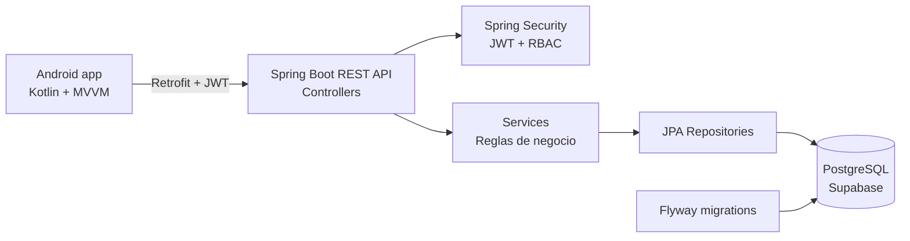

# OdontoSystemMobile — Entrega ABP

Repositorio oficial del proyecto móvil OdontoSystem. La rúbrica vigente para la entrega es **Taller ABP - Entrega 1: Proyecto, Presentación y Repositorio en GitHub (20%)**. La matriz RF01-RF12 de este documento define el alcance funcional del producto.

Plataforma móvil integral para la gestión de citas odontológicas en la provincia de **Ica**, optimizada para conectar pacientes con odontólogos independientes mediante un sistema de reserva express y validación profesional rigurosa.

---

## 1. Descripción y Arquitectura

**OdontoSystemMobile** es una solución desarrollada en **Kotlin** para Android, siguiendo el patrón arquitectónico **MVVM (Model-View-ViewModel)**. La aplicación garantiza una separación clara entre la lógica de negocio, el acceso a datos y la interfaz de usuario, permitiendo escalabilidad y mantenibilidad.

### Stack Técnico:
- **Lenguaje:** Kotlin 1.9+
- **Arquitectura:** MVVM con Repositorios.
- **UI:** XML + Material Design 3 (M3) + View Binding.
- **Red:** Retrofit 2 + OkHttp (con interceptores JWT).
- **Seguridad:** EncryptedSharedPreferences + BCrypt (simulado en backend).
- **Asincronía:** Coroutines y LiveData.

---

## 2. Matriz de Requerimientos Funcionales (RF)

| ID | Requerimiento | Criterio de Aceptación |
| --- | --- | --- |
| **RF01** | Autenticación Segura | Inicio de sesión con JWT y contraseñas encriptadas. Soporte para roles Paciente y Odontólogo. |
| **RF02** | Búsqueda por Distrito | Filtro de odontólogos por los distritos de Ica (Parcona, Los Aquijes, etc.). |
| **RF03** | Reserva Express | Reserva de turno libre en **4 clics o menos** desde la vista de resultados. |
| **RF04** | Historial de Citas | Visualización de citas en estados: **Atendida, Cancelada, Pendiente**. |
| **RF05** | Cancelación Flexible | Cancelación permitida hasta **12 horas antes** con liberación automática e inmediata del turno. |
| **RF06** | Frecuencia de Disponibilidad | Odontólogo puede configurar agenda de forma **Diaria o Semanal**. |
| **RF07** | Bloqueo Express | Switch de emergencia para pausar turnos de hoy sin afectar semanas futuras. |
| **RF08** | Registro Profesional | Carga obligatoria de 4 documentos: **DNI, Título, Colegiatura y CV**. |
| **RF09** | Panel Administrativo | Gestión de validación con estados: **Aprobado, Observado, Rechazado**. |
| **RF10** | Canales de Recordatorio | Notificación en tarjeta de próxima cita e integración con **WhatsApp Business**. |
| **RF11** | Confirmación de Citas | Toggle para alternar entre **Confirmación Manual o Automática**. |
| **RF12** | Nivel de Ocupación | Indicador visual (0-100%) en el perfil público del odontólogo. |

---

## 3. Requerimientos No Funcionales (RNF)

- **RNF01 (Seguridad):** Encriptación de datos sensibles y tokens con expiración controlada.
- **RNF02 (Usabilidad):** Flujo de reserva optimizado para completarse en <4 interacciones.
- **RNF03 (Rendimiento):** Tiempo de respuesta del sistema inferior a **2 segundos** en condiciones normales.
- **RNF04 (Disponibilidad):** Arquitectura preparada para un uptime del **99.9%**.

---

## 4. Integraciones y Canales (RF10)

La plataforma está preparada para la comunicación multicanal:
- **Correo Electrónico:** Envío automático de confirmaciones y cambios de estado.
- **WhatsApp Business API:** Botón de contacto directo y recordatorios automatizados 24h antes de la cita.

---

## 5. Guía de Ejecución

### Prerrequisitos
- Android Studio Ladybug / Meerkat.
- JDK 17 y Android SDK 34 (minSdk 26).

### Instrucciones
1. **Clonar Repositorio:** `git clone https://github.com/usuario/OdontoSystemMobile.git`
2. **Gradle Sync:** Abrir en Android Studio y esperar la sincronización de dependencias.
3. **Compilación:** `Build -> Make Project`.
4. **Ejecución:** Seleccionar emulador o dispositivo físico y presionar `Run 'app'`.

### Módulo Android oficial

El proyecto Android que debe abrirse y entregarse es el módulo raíz `app/`. Está declarado por el [settings.gradle](settings.gradle) mediante `include(":app")`. La carpeta `OdontoSystemMobile/` conserva una copia histórica del módulo y no debe usarse como proyecto principal.

Para conectar el emulador con el backend local, cambia `BASE_URL` en `app/src/main/java/com/odontosystem/app/data/remote/RetrofitClient.kt` a:

```text
http://10.0.2.2:8080/
```

Para un teléfono físico, usa la IP local de la computadora. Para producción, usa la URL pública del backend desplegado.

## 6. Arquitectura de la solución

La aplicación móvil usa MVVM y repositorios. El backend expone una API REST versionada, valida JWT y centraliza la lógica de negocio en servicios. PostgreSQL en Supabase almacena la información y Flyway versiona el esquema.



### Capas principales

- **Android:** UI, ViewModel, Repository, Retrofit y almacenamiento seguro de sesión.
- **Backend:** `controller`, `service`, `repository`, `entity`, `dto`, `security` y `exception`.
- **Seguridad:** JWT con refresh token y roles `PATIENT`, `DENTIST` y `ADMIN`.
- **Persistencia:** PostgreSQL/Supabase con migraciones Flyway reproducibles.

## 7. Backend y API

El backend está en [`backend/`](backend/README.md) y se ejecuta en `http://localhost:8080`. La documentación interactiva queda disponible en:

```text
http://localhost:8080/swagger-ui/index.html
```

Incluye autenticación, odontólogos, citas, pagos, reseñas, chatbot, historias clínicas, odontograma, administración y auditoría.

## 8. Despliegue

### Backend

1. Crear un Web Service en Render o Railway conectado al repositorio.
2. Usar Java 17 y ejecutar `mvn clean package -DskipTests`.
3. Iniciar con `java -jar target/odontosystem-api-1.0.0.jar`.
4. Configurar `DB_HOST`, `DB_PORT`, `DB_NAME`, `DB_USER`, `DB_PASSWORD` y `JWT_SECRET` como variables privadas.

### Android

Actualizar `BASE_URL` con la URL pública del backend y generar el APK o AAB desde Android Studio.

## 9. Verificación de entrega

- Backend conectado a Supabase y migraciones Flyway ejecutadas.
- API documentada en Swagger/OpenAPI.
- Autenticación JWT y autorización por roles.
- Módulo Android oficial definido como `app/`.
- Variables sensibles excluidas del repositorio mediante `.gitignore`.

---

## Información académica

**Curso:** DISEÑO DE APLICACIONES PARA MÓVILES_B1A_27106590_20262

**Docente:** Feibert Alirio Guzmán Pérez

- Doctorando en Administración Gerencial.
- Maestrando en Visual Analytics and Big Data.
- Magíster en Educación.
- Especialista en Big Data e Inteligencia Artificial.
- Especialista en Gerencia Informática.
- Ingeniero de Sistemas.

**Integrantes:**

- Nicole De la Cruz
- Luana Barrientos Espinoza
