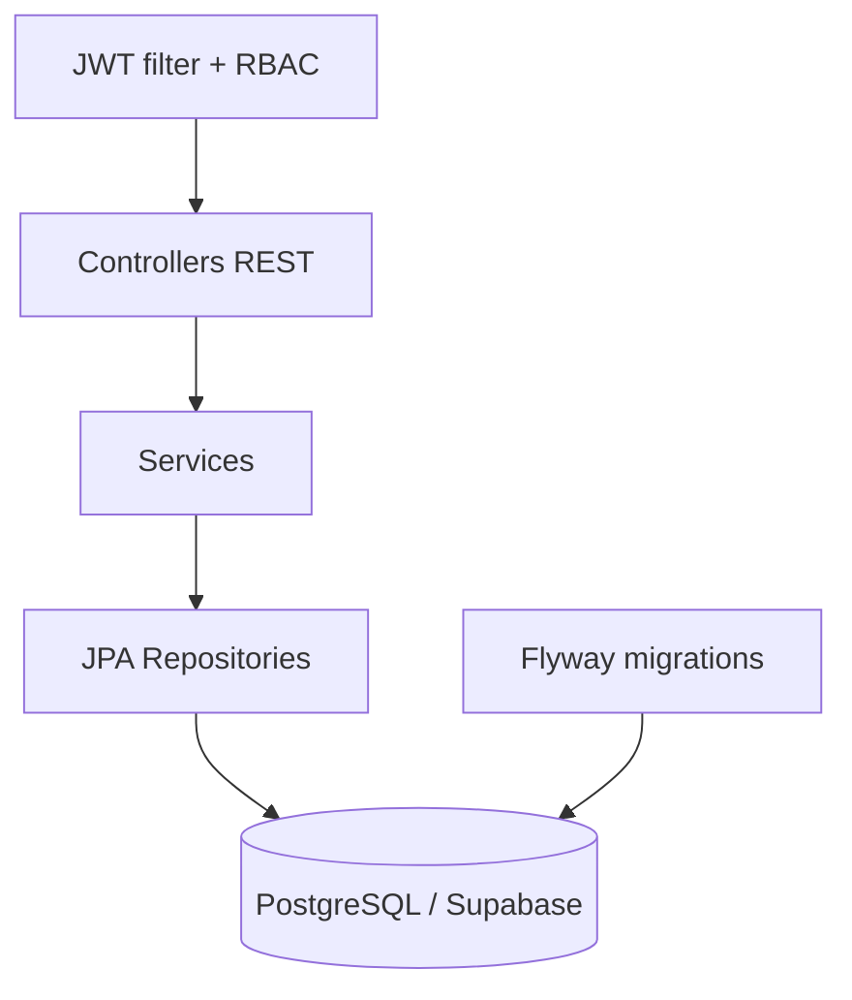

# OdontoSystem API — Backend (Spring Boot)

Backend REST para la aplicación móvil Android **OdontoSystem**, correspondiente
al Taller ABP — Entrega 1 (Diseño de Aplicaciones Móviles, FUCN).

Implementa la API REST que consume el cliente Android (`ApiService.kt`), usando **Spring Boot 3**, **Spring Security + JWT**,
**Spring Data JPA** y **PostgreSQL (Supabase)**.

## 1. Requisitos previos

| Herramienta | Versión mínima | Notas |
|---|---|---|
| JDK | 17 | Usa Eclipse Temurin |
| Maven | 3.9+ | O usa el wrapper `./mvnw` si lo agregas con tu IDE |
| IDE | IntelliJ IDEA Community o VS Code + Java Extension Pack | |
| Cuenta Supabase | — | https://supabase.com (plan gratuito) |
| Postman | — | Para probar los endpoints |

## 2. Crear el proyecto de base de datos en Supabase

1. Entra a https://supabase.com → **New project**.
2. Elige una contraseña segura para la base de datos y guárdala.
3. Cuando el proyecto esté listo, ve a **Project Settings → Database →
   Connection string → URI** (usa el modo *Session pooler* o *Transaction
   pooler* si vas a desplegar en Render, que es lo recomendado).
4. Copia el host, usuario y contraseña — los usarás en el paso 4.

## 3. Abrir el proyecto

1. Abre **IntelliJ IDEA** (o VS Code) → *Open* → selecciona la carpeta
   `odontosystem-api`.
2. Espera a que descargue las dependencias de Maven (icono de progreso
   abajo a la derecha).

## 4. Configurar las variables de entorno

Copia `.env.example` como referencia y define estas variables en tu
sistema, o directamente edítalas en
`src/main/resources/application.properties`:

```
DB_HOST=aws-0-us-east-1.pooler.supabase.com
DB_PORT=5432
DB_NAME=postgres
DB_USER=postgres.xxxxxxxxxxxxxxxxxxxx
DB_PASSWORD=tu_password_de_supabase
JWT_SECRET=una_clave_larga_y_aleatoria
```

> En IntelliJ: *Run → Edit Configurations → Environment variables*, y
> pega ahí las variables en formato `DB_HOST=...;DB_PORT=...;...`

## 5. Ejecutar el proyecto

**Opción A — desde el IDE:** clic derecho en
`OdontoSystemApiApplication.java` → *Run*.

**Opción B — desde la terminal:**
```bash
mvn spring-boot:run
```

Al arrancar, **Flyway ejecuta automáticamente** las migraciones versionadas
`V1__init_schema.sql` hasta la última versión disponible. Estas crean el
esquema de usuarios, odontólogos, citas, pagos, historias clínicas,
odontograma, auditoría y datos de prueba (3 odontólogos y 1 paciente demo:
`paciente@demo.com` / contraseña `123456`).

Si todo va bien, verás en la consola:
```
Tomcat started on port 8080
Started OdontoSystemApiApplication in X.XXX seconds
```

## 6. Probar los endpoints con Postman

### 6.1 Login (ruta pública)
```
POST http://localhost:8080/api/v1/auth/login
Content-Type: application/json

{
  "email": "paciente@demo.com",
  "password": "123456"
}
```
La respuesta incluye un `token`. Cópialo para los siguientes pasos.

### 6.2 Listar odontólogos (ruta protegida)
```
GET http://localhost:8080/api/v1/dentists?district=Miraflores
Authorization: Bearer <token>
```

### 6.3 Ver mis citas
```
GET http://localhost:8080/api/v1/appointments/my-appointments
Authorization: Bearer <token>
```

### 6.4 Crear una cita
```
POST http://localhost:8080/api/v1/appointments
Authorization: Bearer <token>
Content-Type: application/json

{
  "dentistId": "<uuid-de-un-odontologo-obtenido-en-6.2>",
  "date": "2026-09-15",
  "time": "10:00 AM",
  "reason": "Limpieza dental"
}
```

### 6.5 Chatbot
```
POST http://localhost:8080/api/v1/chatbot/message
Authorization: Bearer <token>
Content-Type: application/json

{
  "message": "Busco un odontólogo en Miraflores"
}
```

## 7. Arquitectura



Los controladores reciben DTOs validados, los servicios aplican las reglas de
negocio, los repositorios encapsulan el acceso a datos y Spring Security
protege las rutas mediante JWT y los roles `PATIENT`, `DENTIST` y `ADMIN`.

## 8. Conectar la app Android

En el cliente Android, revisa `RetrofitClient.kt` y cambia la URL base
de `https://odontosystem-api.onrender.com/` a la URL de tu backend:

- En desarrollo local desde el **emulador** de Android Studio:
  `http://10.0.2.2:8080/`
- En desarrollo local desde un **dispositivo físico** en la misma red Wi-Fi:
  `http://<tu-ip-local>:8080/`
- En producción (una vez desplegado en Render): la URL pública que te
  asigne Render.

## 9. Desplegar en Render (producción)

1. Sube esta carpeta `odontosystem-api` a tu repositorio de GitHub
   (dentro de `/backend`, como se documentó en el informe del proyecto).
2. En https://render.com → **New → Web Service** → conecta tu repo.
3. Configura:
   - **Runtime:** Docker o Java (Render detecta Maven automáticamente).
   - **Build command:** `mvn clean package -DskipTests`
   - **Start command:** `java -jar target/odontosystem-api-1.0.0.jar`
4. Agrega las mismas variables de entorno del paso 4 en la sección
   *Environment* de Render.

## 10. Estructura del proyecto

```
odontosystem-api/
├── src/main/java/com/odontosystem/api/
│   ├── config/          # SecurityConfig (CORS, JWT, rutas públicas/protegidas)
│   ├── controller/       # AuthController, DentistController, AppointmentController, ChatbotController
│   ├── dto/              # Objetos de transferencia (espejo exacto de los modelos Kotlin)
│   ├── entity/           # User, Dentist, Appointment (JPA)
│   ├── exception/        # Manejo centralizado de errores
│   ├── repository/       # Interfaces Spring Data JPA
│   ├── security/         # JwtService, JwtAuthFilter, AppUserDetailsService
│   └── service/          # Lógica de negocio (Auth, Dentist, Appointment, Chatbot)
├── src/main/resources/
│   ├── db/migration/     # V1__init_schema.sql (Flyway)
│   └── application.properties
└── pom.xml
```

## 11. Estado y límites conocidos

- El chatbot actual usa reglas locales; una integración con PLN sería una mejora futura.
- El pago implementado es de demostración y no procesa tarjetas reales.
- Antes de desplegar, sustituye cualquier URL local por la URL pública del backend y configura `CORS_ORIGINS`.
